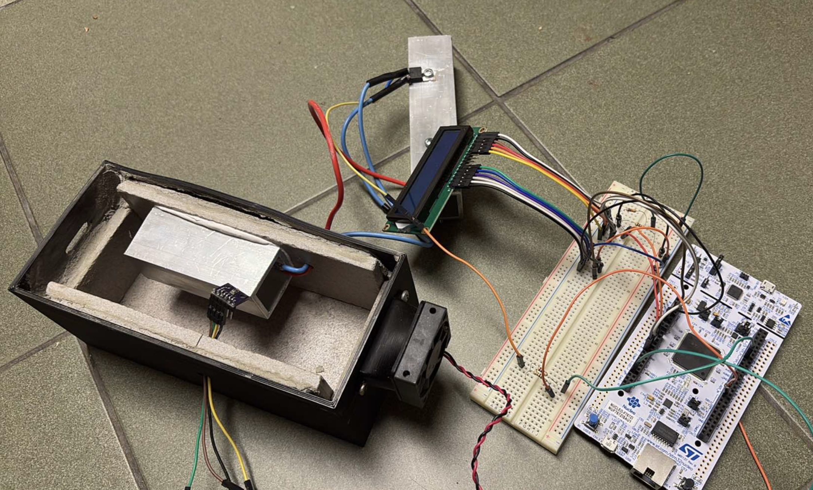
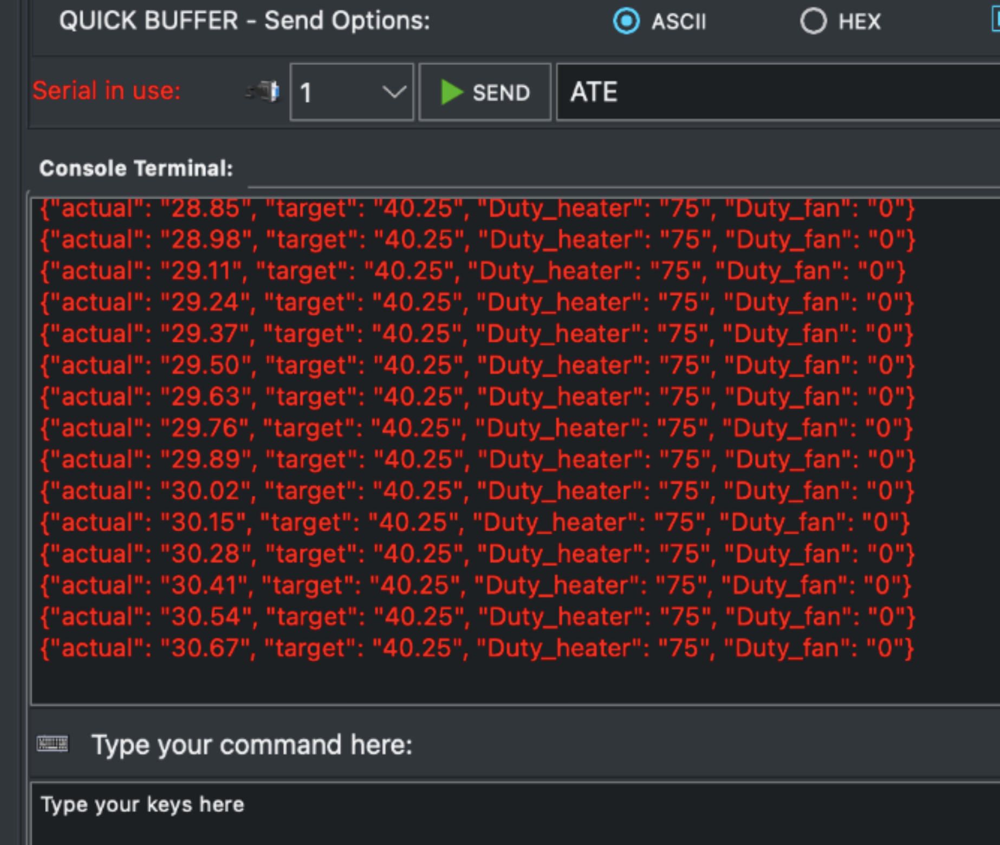

# Heating Chamber with PID Control

A microcontroller-based temperature measurement and control system using a NUCLEO-F746ZG board, BMP280 sensor, thin-film heater, and PWM-controlled fan — all enclosed in a custom 3D-printed chamber.

---

## Overview

The objective was to create a system capable of measuring and regulating the temperature of a heater. We utilized a BMP280 temperature sensor to monitor the heater's temperature and a fan to cool it down when necessary. For improved accuracy and stability, we enclosed the system within a 3D-printed plastic box. Inside the enclosure, we placed concrete slabs to prevent the plastic from deforming due to heat. The heating element consisted of a thin-film power heater, surrounded by a metal structure to enhance heating efficiency. The temperature sensor was positioned near the metal to ensure precise temperature measurements.

<p align="center">
  
  <br><em>Fig. 1 Scheme of the control system</em>
</p>

---

## Hardware

- **NUCLEO-F746ZG** — main microcontroller board
- **BMP280** — digital temperature sensor connected via I2C (SCL → PB6, SDA → PB9)
- **Thin-film power heater** — PWM-controlled, capped at 75% duty cycle
- **Fan** — PWM-controlled (PD12), activates proportionally to temperature overshoot
- **3D-printed enclosure** with concrete slabs for thermal insulation

---

## Features

- **Cyclic temperature measurement** at 200 ms sample time (5 Hz) using TIM2
- **PID temperature control** with tuned Kp, Ki, Kd gains for stable regulation in the 20–40°C range
- **Steady-state error** maintained within 5% (1°C) and 1% (0.2°C) of the control range
- **Serial port interface (UART)** — set target temperature with `Target:<float>` command, read current values (actual temp, target temp, heater duty, fan duty) as JSON
- **Fan cooling** — activates only when temperature overshoots the setpoint, proportional to the error

---

## PID Controller

The system uses a PID control algorithm with anti-windup protection. The heater output is capped at 75% duty cycle, and the fan activates proportionally when the temperature exceeds the setpoint.

```
Kp = 12.5     Ki = 0.35     Kd = 0.035
```

```
f_TIMER = f_CLK / ((CounterPeriod + 1) * (Prescaler + 1))
        = 96 000 000 / ((1999 + 1) * (9599 + 1))
        = 5 Hz
```

---

## Serial Communication

The system communicates via UART (USART3) using interrupt-driven reception.

**Set target temperature:**
```
Target:35.40
```

**JSON response (every cycle):**

<p align="center">
  
  <br><em>Fig. 2 Serial output showing temperature rising to the target value</em>
</p>
